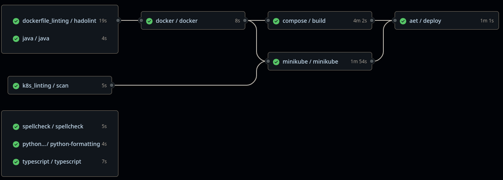

# What's In My Fridge?


> *"We went looking for a snack and found an error instead."*

A full-stack AI-powered recipe suggestion platform for anyone overwhelmed by decision fatigue or plagued with a lack of creativity. Users can manually input ingredients or upload fridge images to receive tailored recipe suggestions based on those ingredients. Built with a microservice architecture and deployed to [Rancher](https://rancher.ase.cit.tum.de/dashboard/home) with monitoring, authentication, and modern DevOps best practices.

## 🧠 Team

- [Franz](https://github.com/kunzef)
- [Kristi](https://github.com/kristi-balla)
- [Marcel](https://github.com/Marcel510)

For the responsibilities of each individual, please have a look at the `CODEOWNERS` file. It contains the root folders and the one with the largest contributions in that area. That is also why that person ought to be marked as reviewer in the PRs targeting those folders.

## 🧪 Technologies Used

* **Client:** React
* **Server:** Spring Boot (Java 21)
* **GenAI**: FastAPI + Langchain
* **Containerization:** Docker
* **Observability:** Prometheus, Grafana
* **Auth:** GitHub OAuth + JWT
* **CI/CD:** GitHub Actions

## 🧱 Architecture Overview

Please look into the following links for the corresponding UML diagram:

- [Top-Level Architecture](https://apollon.ase.in.tum.de/uvM3IXUBNmxOEgEQtCfo?view=COLLABORATE)
- [Use Cases](https://apollon.ase.in.tum.de/HfJyHdLFzQr5510wyMBn?view=COLLABORATE)
- [Analysis Object Model](https://apollon.ase.in.tum.de/kKEuL8WLVCOCrpba64ri?view=COLLABORATE)

## 🚀 Developing Locally

### Prerequisites

Depending on how you want to run the application, you will have to install different tools. This project takes a container-first approach, so installing `docker` is essential! Installing the following tools depends on your particular use case:

- **Node.js (v18+) and Java 21**: if you want to develop locally
- `minikube`, `kubectl` and `helm` if you want to test the deployment on a k8s cluster

### Docker Compose

You will spin up the app using docker compose. A simple choice for quick development cycles.

1. Generate a self-signed key-pair. This will be used by nginx when serving https. You will get a warning in your browser about an untrusted certificate, but [that's fine](https://www.youtube.com/watch?v=0oBx7Jg4m-o):

```bash
./infra/scripts/generate_key_and_cert.sh
```

2. Start:

```bash
docker compose up
```

When running often, you might want to add the `--force-recreate` flag to docker compose. In addition, if you make changes to the services themselves, the `--build` option is also necessary. The application is available on [https://fridge.localhost/](https://fridge.localhost/).

3. If you want to work with particular services quickly, you can also address them directly, like curl some service:

```bash
curl -X POST -k https://fridge.localhost/api/images/v1/recipes/explore -F "file=@fruit-and-veg-in-a-fridge.png;type=image/png" -F "numRecipes=2"
```

For debugging purposes, it might help to add `-vvv` to curl for increased logging. Bear in mind that this request can take up to 1min to complete.

4. Finish:

```bash
docker compose down --volumes --remove-orphans
```

### Minikube

You will spin up a minikube cluster. Choose this to emulate the AET cluster we are given:

1. Start:

```bash
minikube start --cpus=6 --memory=6sG
```

Due to our self-chosen service requests in the corresponding deployments, each service (users, recipes, images, genai, prometheus and grafana) needs half a CPU core. Empirical trials have shown the services function optimally in such setting. If your pods start failing with scheduling errors because the kubelet couldn't satisfy the requests, then you know where to change it

1. Install our chart:

```bash
./infra/scripts/setup.sh
```

This will install all necessary CRDs as well as our chart with the `values.local.yml`: tailored for local development. Empirical tests show that this command takes about 3-6min, depending on how fast your internet connection is and the machine you are minikube on.

3. Adapt your hosts file to point to the cluster. After this, the website will be available on [https://fridge.example/](https://fridge.localhost/).

```bash
echo "$(minikube ip) fridge.example" | sudo tee -a /etc/hosts
```

4. Again, you can dial up services independently. However, for some you might need to authorize yourself via a bearer token. You get that if you look into the requests when logging in, or the logs of the `client` pod:

```bash
curl -vvv -X POST -k https://fridge.example/api/images/v1/recipes/explore -F "file=@fruit-and-veg-in-a-fridge.png;type=image/png" -F "numRecipes=2" -H "Authorization: Bearer <your token>"
```

5. Yeet

```bash
minikube delete
```

This request will also take about 1min to complete, but in the end, you will see the recipes! 

#### Things to consider

Whenever something goes wrong or doesn't behave correctly, minikube can be a pain to delete. If you changed something in the services, you can also try the following to get the changes to your cluster:

1. Rebuild the image(s):

```bash
BRANCH="the branch you're working on" docker compose build
```

2. Push to our registry! This is a workaround, that is why I insist on specifying the branch name! That way, we do not clutter main.

```bash
docker push <image>
```

Make sure you are logged into the ghcr and your token has the correct permissions!

3. Trigger a manual upgrade:

```bash
helm upgrade --install fridge ./infra/fridge --namespace team-404-name-not-found --create-namespace --atomic -f infra/fridge/values.local.yaml
```

## Deployment on AWS

There are 2 workflows that need to be triggered manually to deploy on AWS. This was chosen due to the [learning lab](https://awsacademy.instructure.com/courses/122750/modules/items/11621630) being ephemeral and only persisting for 4h. You can find the aforementioned actions in the [actions](https://github.com/AET-DevOps25/team-404-name-not-found/actions) tab, labeled as "manual".

You will need the following secrets for those jobs:

- `AWS_ACCESS_KEY_ID` --> retrievable by the same-named variable on the learning lab page
- `AWS_SECRET_ACCESS_KEY` --> retrievable by the same-named variable on the learning lab page
- `AWS_SESSION_TOKEN` --> retrievable by the same-named variable on the learning lab page
- `AWS_PRIVATE_KEY` --> this is the ssh key from the learning page
- `DOCKER_CONFIG` --> a base64 encoded representation of a `~/.docker/config.json` with read permissions on packages for ghcr.io. We recommend you create this via `cat ~/.docker/config.json | base64 -w0`

After that, the deploy job ought to run without issues. During it, the `tfstate` is uploaded as an artifact. This is needed for the teardown job. It obviously needs to know the state to be able to destroy the built resources. However, since it's another workflow, you would also need to tell it the `run-id` of the deployment workflow. You can find this in the browser from the link: `https://github.com/AET-DevOps25/team-404-name-not-found/actions/runs/16350870391` <-- the number after `/runs` is the id the job needs.

## 📈 Metrics & Monitoring

Prometheus scrapes data from all microservices of the server, as well as genai. The data is aggregated in 3 grafana dashboards, depicting the state of each application, the JVM and genai-specific stats. You can view the dashboards by appending `/grafana` to whatever host you are running the app on. 

In addition, grafana alerts are also configured. An alert fires if a request takes longer than 60s to complete or if the spring-boot apps start hogging more than 500MiB of the JVM heap.

## 📁 Repository Structure

```
client/               # React + Tailwind web UI
genai/                # FastAPI AI service
server/
  images/             # Accepts image uploads and queries GenAI
  recipes/            # Provides recipes based on ingredients
  users/              # Handles OAuth & JWT issuance
  ingredients/        # manages ingredients on the fridge
infra/
  fridge/             # Helm templates, config files
  ec2/                # terraform ansible config to provision and deploy on an ec2 instance
  nginx/              # proxy configuration
  scripts/            # a summary of convenience scripts
.github/              # GitHub Actions CI pipelines
```

### Server

The `server` directory contains a multi-project gradle-based spring boot application. The `settings.gradle` file references the underlying applications. To refactor common dependencies and save ourselves some writing efforts, a custom spring boot plugin was written. To have a look into the common dependencies, look into the `buildSrc` folder. The projects themselves however still are in control: they can define other dependencies to include next to the pre-defined ones, or exclude some of the pre-defines ones. Other than this, each service looks and is structured just like any other spring boot project. 

#### Users

This is the first interaction point with the system. Clients must call the `/api/users/login` endpoint and listen on `/ui/v1/callback`. The JWT will be provided as a query parameter with the key `token`. This service also offers the `/api/users/callback` endpoint to GitHub as our OAuth provider. In addition, the service uses `/api/users/auth` as an internal endpoint for token validation and to return a userId from the token. This endpoint is meant to be queried by proxies as their `auth_request`.

Lastly, this service offers `/api/users/whoami` for conveniently checking the userID. For this, clients will need to provide the token from the login endpoint.

#### Recipes

A simple service offering CRUD operations under the `/api/recipes` prefix. The service manages recipes for each user. In addition, it wraps calls to the AI service. Due to the basic nature of this service, the ingredients will have to be input manually.

#### Ingredients

A simple service offering CRUD operations under the `/api/ingredients/v1` prefix. It manages the ingredients currently available in a user's fridge. This isn't bound to the recipes a user generates, since those can also be suggestions or favorites.

#### Images

A simpler service serving under the `/api/images/v1` prefix. This service wraps the image-related calls to the AI service. Its existence is justified by the fact that the AI service accepts base64 encoded strings as images, whereas browsers can inherently support uploading of `multipart/form-data`. This services takes care of converting between the two.

After it receives the ingredient list from the AI service, it saves those ingredients with the ingredients service. Then, it queries the recipes service for a recipe and returns the suggestions to the calling client. It is worth noting that while the ingredients are saved by default, the recipes **are NOT**.

### Client

The client directory contains a React application built with Vite and Tailwind CSS. It serves as the user interface for the application, allowing users to interact with the server services.  
The client handles user authentication, ingredient management, recipe management, image uploads, and displays recipe suggestions based on the ingredients provided by the user.  
The production build is a simple docker image with nginx serving the static files, mapping the `/` prefix to `index.html`. 

More detailed information can be found in the [client README](./client/README.md).

### GenAI

TODO: do the thing

### Infra

This folder contains the entire configuration of our deployment infrastructure. The `fridge` folder contains a helm chart of the application. We tried to extract almost everything into code, which is why many grafana dashboard configurations and prometheus sources can be found in the root. The `templates` subdir contains our manifests. We follow a plain deployment --> service --> ingress rule path. `ConfigMap`s or `Secret`s are defined as needed. Each `Deployment` specifies all available probes to make sure the application is healthy. In addition, resource limitations are also set, to make sure we do not overhaul all memory. Furthermore, the below annotation is also provided in the container spec template:

```yml
spec:
  template:
    metadata:
      annotations:
        image-deployment: {{ now | date "Mon, 02/01/06, 03:04PM" }}
```

Our `imagePullPolicy` is `Always`, but we reference images based on tags rather than digests. This was done to make developing locally easier. However, when pushing a new image under the same tag, the kubelet won't update it when redeploying. In the lack of a proper CD tool like Flux, we go for this workaround: when redeploying or upgrading, the timestamp will change, causing the pod template to change, causing the image to be pulled anew.

Other folders are `ec2`, `nginx` and `scripts`. The latter is a collection of convenience scripts for developers. As one could guess, we picked `nginx` as our proxy. The decision was enforced due to lacking support for the GatewayAPI and the default usage of the nginx ingress controller on the provided cluster. The last folder contains the terraform and ansible configuration to provision an EC2 instance and deploy our docker compose application there.

### CI/CD



Our CI initially performs some basic spellchecks, linting and formatting for java, python and typescript projects. In addition, we also lint our k8s manifests and dockerfiles. In the following we will go into some of the most notable aspects of the pipeline:

#### Main CI

We go big on reusable workflows! The whole point is to write code once and reuse it, should the need arise. The only exception from this rule are the EC2 deployment steps. Since the session we are given is ephemeral, the actions aren't automatic, but have to be manually triggered. Lastly, the workflows restrict themselves to run only on changes to corresponding files. Since github doesn't support checking for such files out of the box, we utilize the [dorny/paths-filter@v3](https://github.com/dorny/paths-filter/tree/v3/) action.

#### Java

This workflow heavily relies on [burrunan/gradle-cache-action@v3](https://github.com/burrunan/gradle-cache-action). It creates a layered gradle cache using github's artifacts to speed up pipeline runs of gradle-based projects. We lint the java files and the gradle files themselves with [checkstyle](https://checkstyle.org/index.html), check for common bugs using [spotbugs](https://spotbugs.github.io/), run the tests and upload a [jacoco](https://www.jacoco.org/jacoco/trunk/doc/) test report.

#### Typescript
This actions sets up a node environment, installs the npm dependencies with automatic caching, runs ESLint for typescript linting and Prettier to check the code formatting, and runs the tests using vitest.

#### Docker

Instead of going for the base docker workflow, we use for more configurable `bake` interface and the corresponding action: [docker/bake-action@v4](https://github.com/docker/bake-action/tree/v4/). Our bake configuration is in the root of this project: `docker-bake.hcl`. The most interesting part of that is configuring the cache options in the same file as the build logic and context. Despite the HCL providing some convenience functions, I couldn't find a DRYier way of defining the image name and tag.

#### Compose

This is a minimalistic workflow that starts a base integration test. It deploys the docker compose application on the VM hosting the runner from the newly built images. It then proceeds to check whether the running containers are healthy.

#### Minikube

The core action from this is [medyagh/setup-minikube@latest](https://github.com/medyagh/setup-minikube/tree/latest/). It spins up a minikube cluster in the runner itself! The action is maintained by the official minikube maintainers. After the cluster is up, we install the CRDs and tools we need and start the tests. The integration test logic for the minikube cluster is the same as the one for the compose workflow.

The interesting thing here is that our repo got to be an official example of the action and thus referenced into their readme! :D

#### Deployment

The deployment then ensues to the AET Rancher cluster. The steps are the exact same as the minikube cluster, with the exception that we no longer spin up a cluster here, but rather point the kubeconfig to the correct one.

## 🧪 Future Improvements

- Add retry logic on inter-service communication
- Improve UI polish and mobile responsiveness
- Integrate image preprocessing (e.g., resizing, normalization)
- Better error handling & fallback recipes
- A proper GitOps approach and sops

## 🐛 Frequently Encountered Errors

Here is a summary of sanity checks to go through when debugging an error. The list isn't exhaustive, but rather a compilation of what we came through often.

### The Application Doesn't Reflect Your Changes?

Make sure you aren't loading older values from the cache! It might help to rebuild with `--no-cache` or just `docker system prune -f --volumes` if you want to go nuclear. If running on minikube, the images are pulled from the GHCR, so make sure your changes are properly synchronized

### Your Pods Complain About Lacking Resources?

Maybe you are pushing the limits of your local minikube cluster. Consider giving your cluster more juice.

---

> "404? Not this time. We found the ingredients for success."
