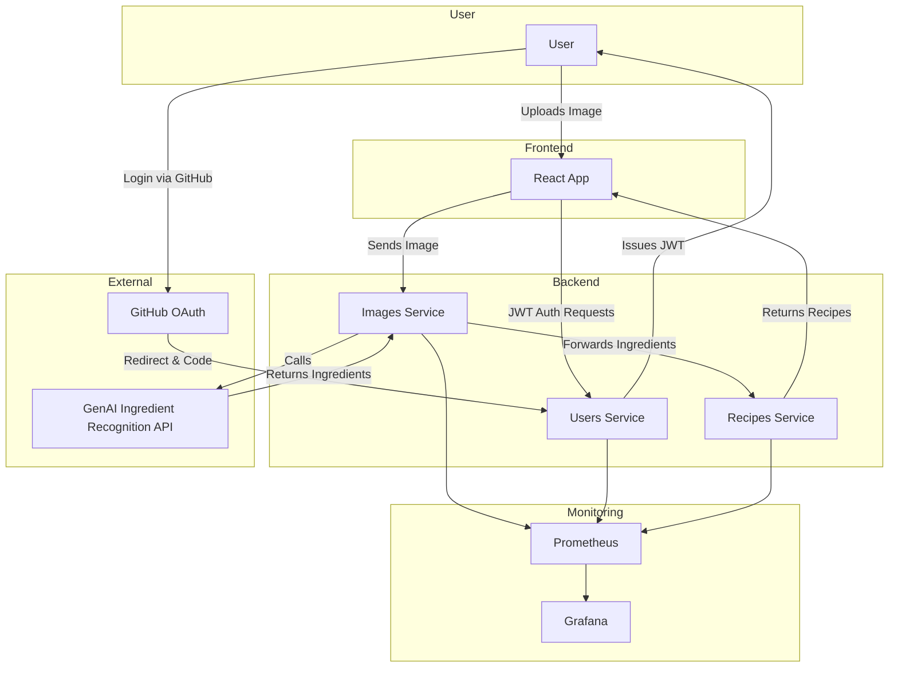

# Team 404 - Name Not Found

> *"We went looking for a snack and found an error instead."*

A full-stack AI-powered recipe suggestion platform built by the AET-DevOps25 cohort. Users upload food images to receive ingredient recognition via AI, and are then presented with tailored recipe suggestions based on those ingredients. Built with a microservice architecture and deployed to Kubernetes with monitoring, authentication, and modern DevSecOps best practices.

---

## 📸 What It Does

* Upload an image of ingredients
* Recognize ingredients using a GenAI model
* Suggest personalized recipes based on ingredients
* Authenticate via GitHub OAuth
* Visualize metrics via Prometheus and Grafana

---

## 🧱 Architecture Overview



All services are deployed in Kubernetes and observable via Prometheus and Grafana.

---

## 🧪 Technologies Used

* **Frontend:** React + TailwindCSS
* **Backend:** Spring Boot (Java 21)
* **Containerization:** Docker, Podman
* **Orchestration:** Kubernetes (k3d / k3s)
* **GitOps:** FluxCD
* **Observability:** Prometheus, Grafana
* **Auth:** GitHub OAuth + JWT
* **CI/CD:** GitHub Actions

---

## 🚀 Getting Started (Locally)

### Prerequisites

* Docker or Podman
* Node.js (v18+)
* Java 21
* `kubectl` + a running Kubernetes cluster (e.g., k3d)
* `flux`, `helm`, `kustomize` installed

### Backend

```bash
cd services/images-service
./gradlew bootRun

cd ../recipes-service
./gradlew bootRun
```

### Frontend

```bash
cd frontend
npm install
npm run dev
```

### Deployment via Flux

```bash
cd infra
make deploy
```

---

## 📈 Metrics & Monitoring

Prometheus scrapes:

* `images-service` on `/api/images/actuator/prometheus`
* `recipes-service` on `/api/recipes/actuator/prometheus`

Visualize metrics on Grafana, pre-configured in the deployment.

---

## 🔒 Authentication Flow

1. User clicks "Login with GitHub"
2. GitHub redirects to `/api/users/callback`
3. JWT is issued by Spring Boot and stored in a cookie
4. Backend routes are protected using NGINX Ingress + `auth_request`

---

## 📁 Repository Structure

```
frontend/            # React + Tailwind web UI
services/
  images-service/    # Accepts image uploads and queries GenAI
  recipes-service/   # Provides recipes based on ingredients
  users-service/     # Handles OAuth & JWT issuance
infra/
  manifests/         # Helm templates, Kustomize overlays
  Makefile           # Terraform, Ansible & deployment logic
.github/             # GitHub Actions CI pipelines
```

---

## 🧠 Team

Meet the minds behind "Name Not Found":

* Kristi
* Marcel
* Franz

Special thanks to AET-DevOps25 instructors and mentors!

---

## 🛡️ License

Licensed under the MIT License. See `LICENSE` for details.

---

## 🏁 Badges (Add These to Your GitHub Page!)

```markdown


```

---

## 🧪 Future Improvements

* Add retry logic on inter-service communication
* Improve UI polish and mobile responsiveness
* Integrate image preprocessing (e.g., resizing, normalization)
* Better error handling & fallback recipes

---

> "404? Not this time. We found the ingredients for success."
