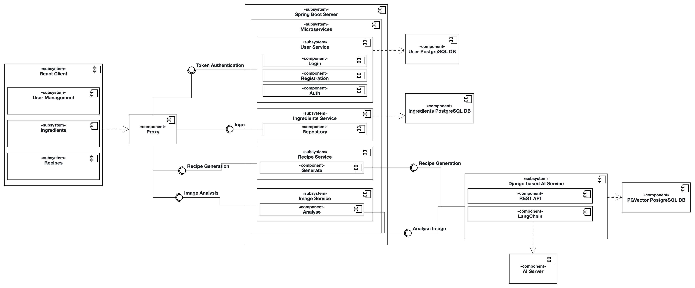
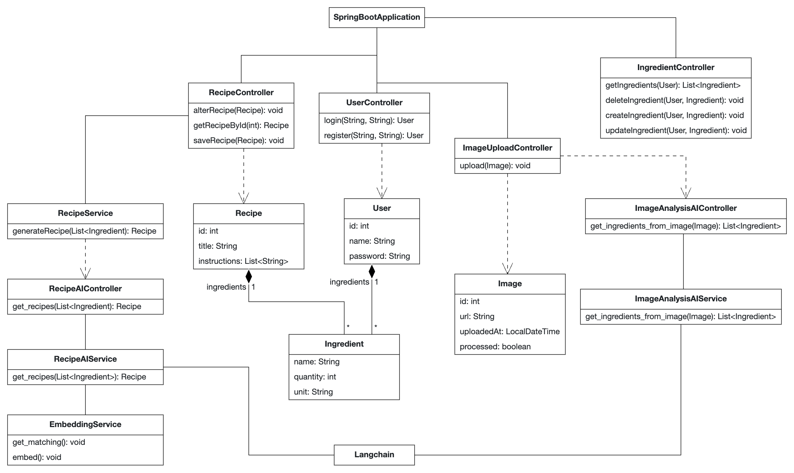
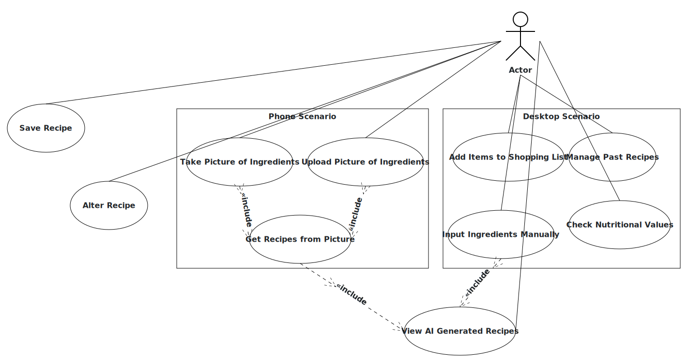

# UMLs

## Top-Level Architecture (TLA)

*UML component diagram of top-level architecture*

### Server
#### Ingredients Service

This service manages the ingredients which a user currently has in its fridge. Provides access to this information and allows adding or removing ingredients.

#### Recipe Service

This is the service that talks to the AI-service to generate recipe suggestions. It will mainly be used to provide ingredients in a digestible way for that service.

#### Image Service

This service accepts images of fridges and analyzes them for the available ingredients.

#### User Service

This is the service that manages users. Nothing fancy will transpire here, just mere user registration and login. Passwords will be saved hashed. Maybe a JWT will be enforced per request, maybe not, it is to be decided.

#### Database

We decided to go for PostgreSQL. It has great community support, as well as a huge database of plugins, such as pg-vector, which facilitates RAG.

### AI

#### Django Webserver

Rest entry point for the AI service.
It will be responsible for exposing an API to the other services and managing the connection to the vector database.
Internally embeddings will be generated using LangChain through the OpenAI-Api.
The same goes for the prompts. Both subject to change depending on the resources provided by the lecture.

#### PGVector DB

Vector database to store recipe embeddings. Hosting depends on lecture (s3 direct or in container on vm).

## Analysis Object Model (AOM)

*UML class diagram of AOM (Server + GenAI)*

## Use-Cases

*UML use case diagram of main use cases*

