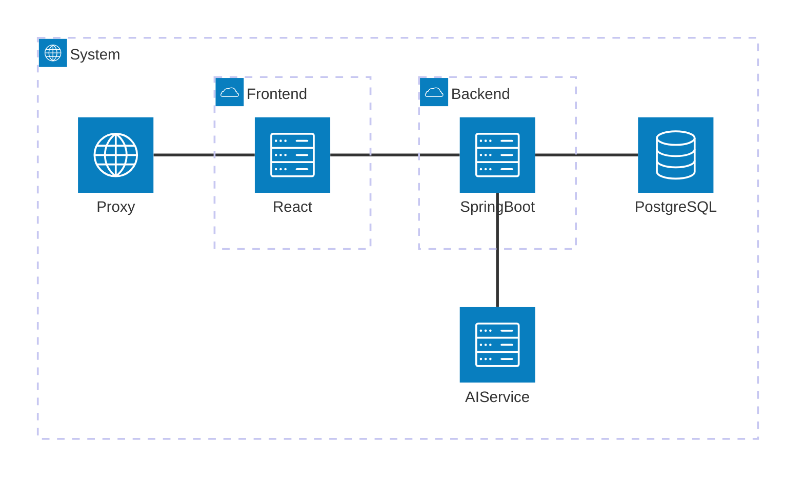

# UMLs

Here are my ideas about the architecture of the project. I am open to discussing changes or making improvements!

The top-level architecture is fairly simple: we have a frontend system, a backend system, a database containing all the data and the AI for the magic. The Proxy is there to terminate TLS, as well as provide potentially useful middleware functionality such as authentication, circuit breaker pattern implementations and other headers.

## Frontend

TODO: think about the feasibility of even defining multiple services here! Maybe we won't need them!

## Backend

Here's a split of the backend to its components:

The 3 components are each responsible for the following:

### Recipes

This is the single contact point for the frontend. It manages all recipe-related operations and reaches out to the other two services when it comes to generating recipes or storing them

### Suggestions

This is the service that talks to the AI-service. It will mainly be used to parse inputs in a digestible way for that service

### Storage

This is the service that talks directly to the DB. Think of it as an ORM with some convenience functions.

## Database

We decided to go for PostgreSQL. It has great community support, as well as a huge database of plugins, such as pg-vector, which facilitates RAG.

## AI

## Django Webserver
Rest entry point for the AI service. 
It will be responsible for exposing an API to the other services and managing the connection to the vector database.
Internally embeddings will be generated using LangChain through the OpenAI-Api.
The same goes for the prompts. Both subject to change depending on the resources provided by the lecture.

## PGVector DB
Vector database to store recipe embeddings. Hosting depends on lecture (s3 direct or in container on vm). 
